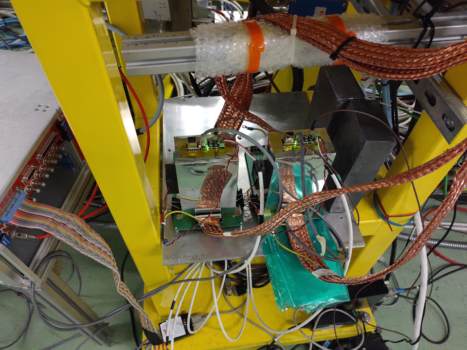
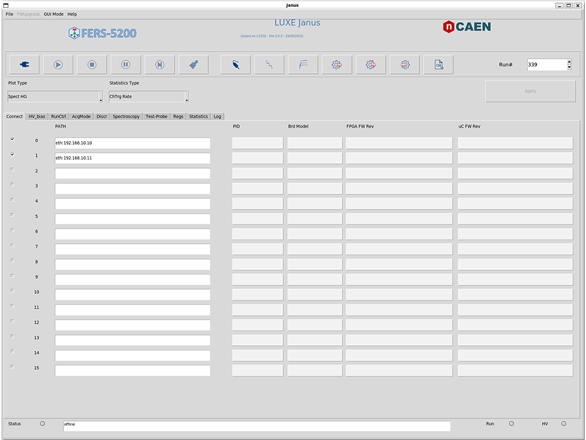
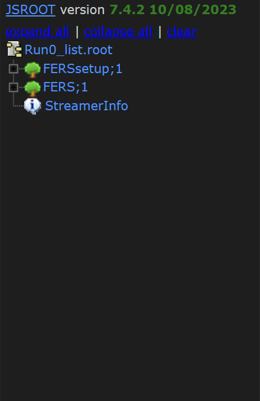
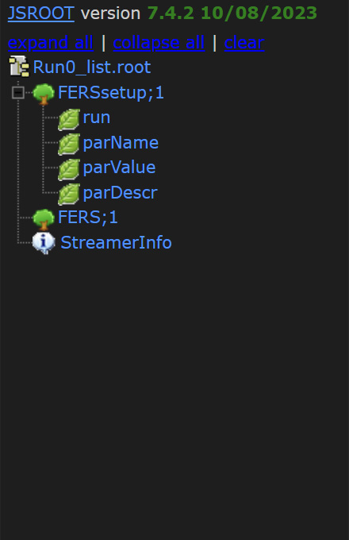
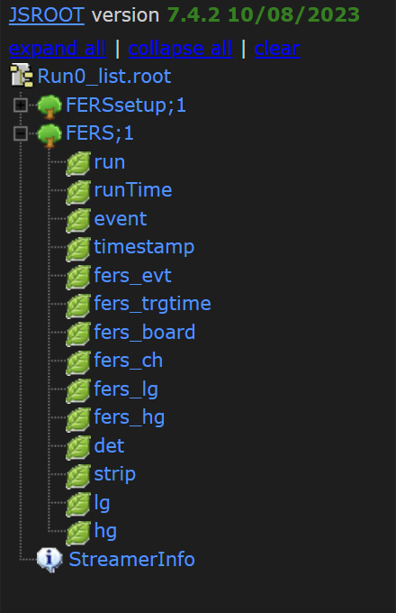
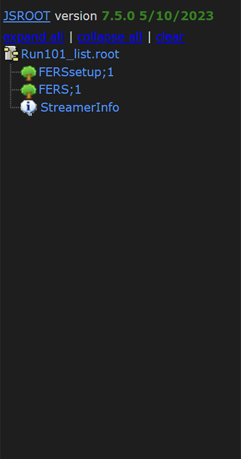
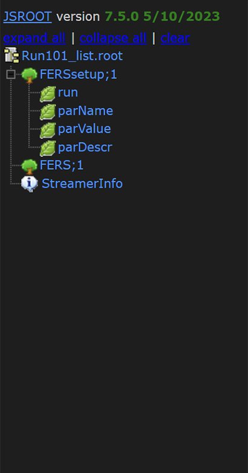
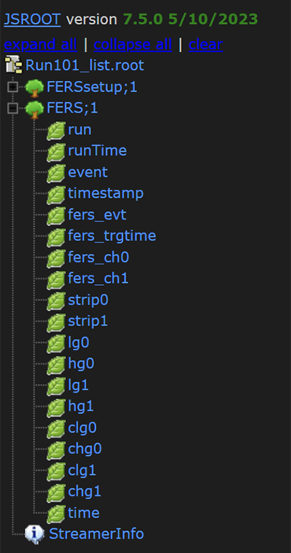

# A5202toROOT - JanusC txt-to-root converter

An essential python script to convert (either online or offline) the Caen FERS-A5202 text output file (.txt) produced by JanusC (i.e., Run*_list.txt, Run*_Info.txt) to ROOT file (Run*_list.root).

## Table of Contents

- [Scientific setting](#scientific-setting)
- [Brief description](#brief-description)
- [Installation](#installation)
- [ROOT structure](#root-structure)
- [Contributing](#contributing)
- [License](#license)

## Scientific setting
Caen FERS-A5202<sup>[[1]](#1)</sup> is a 64ch frontend unit based on the Weeroc Citiroc-1A ASICs. It is part of the FERS 5200 readout system. It can be used either as standalone card - e.g., using a Linux/Windows DAQ pc via ethernet/usb connection - or with a data concentrator. The former solution can be used in slow trigger rate applications with a small ($\sim 1\text{-}5$) number of cards, while the latter is best suited for large number of frontend units.<br>

This software is a byproduct of software development of a test beam of two sapphire (Al2O3) 192-strip sensors, developed for the LUXE experiment<sup>[[2]](#2)</sup>. Two A5202 readout cards have been used, in 'Spectroscopy mode'. They were controlled by the the software JanusC/JanusGUI, provided by Caen, which interfaces with the cards and produces output file either in binary or ascii text format. The latter has been used.

<div style="margin-left: auto; margin-right: auto;"></img></img></div>

### References
<a id="1">[1]</a> Caen 5202 webpage https://www.caen.it/products/a5202/ <br>
<a id="2">[2]</a> Abramowicz, H., et al. "Technical Design Report for the LUXE Experiment." arXiv:2308.00515 (2023). <br>

## Brief description
The scripts looks for the content of the directory `a5202dataDir`. It waits for the current acquisition to close, and finally it converts the run data into a ROOT file saved in the `outputROOTdirectory`.
<!-- The default input/output paths can be overridden by passing the two arguments to the application:
```
python fers.py <inputTXTdir> <outputROOTdir>
```
-->
The script runs either online (while JanusC is running) or offline, completely independent from JanusC acquisition application. 

## ROOT structure
Run data is stored by JanusC in ascii text format in a couple of files 'Run*_list.txt' and 'Run*_Info.txt': the former containing the data from each channel/board and the latter the board configuration info. For each run, the readout data is appended into the '_list'. The file '_Info' is generated at the end of the run. This promts the python script to convert the data into a ROOT file.

There are two possible structures for the output ROOT files, depending on what is more convenient for you you can turn one the first or second by operating on the flag `rfoutFormat` when calling the script from command line (see Section Usage for details.)

### Plain ROOT structure (default)
The default structure of the ROOT file is shown below

<div style="margin-left: auto; margin-right: auto;"></img></img></img></div>

- **FERSsetup** contains the configurations used to setup the cards before acquisition starts; branch datatypes are string in order to accomodate for different frontend cards and firmaware updates, i.e. which could vary the parameters name;
- **FERS** is a template TTree with structured data. It contains both raw data (fers_) and calibrated/processed data (det,strip,lg,hg). This can be changed acting on the rdataStruct.py and implementing his/her own callable for TTree filling (in fers.py)

Detailed description of the TBranches is inserted as TBranch title. For example the output of `FERS->Print()` and `FERS->GetBranch(branchName)->GetTitle()` where **branchName** is the TBranch name (e.g., run, runTime, event, timestamp, ...)
```c++
   ------------------------------------------------------------------
  | Welcome to ROOT 6.28/04                        https://root.cern |
  | (c) 1995-2022, The ROOT Team; conception: R. Brun, F. Rademakers |
  | Built for linuxx8664gcc on Jul 08 2023, 11:06:00                 |
  | From heads/latest-stable@49886c13                                |
  | With c++ (Ubuntu 11.3.0-1ubuntu1~22.04.1) 11.3.0                 |
  | Try '.help'/'.?', '.demo', '.license', '.credits', '.quit'/'.q'  |
   ------------------------------------------------------------------

Attaching file Run1_list.root as _file0...
(TFile *) 0x561342150010
root [1] .ls
TFile**         Run1_list.root
 TFile*         Run1_list.root
  KEY: TTree    FERSsetup;1     TTree with run FERS setup settings
  KEY: TTree    FERS;1  FERS processed data
root [2] FERS->Print()
******************************************************************************
*Tree    :FERS      : FERS processed data                                    *
*Entries :   184128 : Total =        16257518 bytes  File  Size =     733331 *
*        :          : Tree compression factor =  22.30                       *
******************************************************************************
*Br    0 :run       : UInt_t Run id number                                   *
*Entries :   184128 : Total  Size=     738977 bytes  File Size  =       6118 *
*Baskets :       24 : Basket Size=      32000 bytes  Compression= 120.66     *
*............................................................................*
*Br    1 :runTime   : Double_t Posix time of the run start on the PC         *
*Entries :   184128 : Total  Size=    1477791 bytes  File Size  =      13673 *
*Baskets :       47 : Basket Size=      32000 bytes  Compression= 107.99     *
*............................................................................*
*Br    2 :event     : UInt_t Event id number                                 *
*Entries :   184128 : Total  Size=     739033 bytes  File Size  =       5725 *
*Baskets :       24 : Basket Size=      32000 bytes  Compression= 128.95     *
*............................................................................*
*Br    3 :timestamp : Double_t Event posix timestamp (absolute)              *
*Entries :   184128 : Total  Size=    1477886 bytes  File Size  =      29077 *
*Baskets :       47 : Basket Size=      32000 bytes  Compression=  50.78     *
*............................................................................*
*Br    4 :fers_evt  : UInt_t FERS event ID [0-1000]                          *
*Entries :   184128 : Total  Size=     739121 bytes  File Size  =      10095 *
*Baskets :       24 : Basket Size=      32000 bytes  Compression=  73.14     *
*............................................................................*
*Br    5 :fers_trgtime : Double_t FERS trigger time from run start [us]      *
*Entries :   184128 : Total  Size=    1478041 bytes  File Size  =      37078 *
*Baskets :       47 : Basket Size=      32000 bytes  Compression=  39.83     *
*............................................................................*
*Br    6 :fers_board : UInt_t FERS board ID [0,1]                            *
*Entries :   184128 : Total  Size=     739172 bytes  File Size  =       9254 *
*Baskets :       24 : Basket Size=      32000 bytes  Compression=  79.79     *
*............................................................................*
*Br    7 :fers_ch   : UInt_t FERS channel number [0-63]                      *
*Entries :   184128 : Total  Size=     739098 bytes  File Size  =      11530 *
*Baskets :       24 : Basket Size=      32000 bytes  Compression=  64.03     *
*............................................................................*
*Br    8 :fers_lg   : Int_t FERS low-gain ADC signed value [int32]           *
*Entries :   184128 : Total  Size=     739110 bytes  File Size  =     368115 *
*Baskets :       24 : Basket Size=      32000 bytes  Compression=   2.01     *
*............................................................................*
*Br    9 :fers_hg   : Int_t FERS high-gain ADC signed value [int32]          *
*Entries :   184128 : Total  Size=     739111 bytes  File Size  =     164131 *
*Baskets :       24 : Basket Size=      32000 bytes  Compression=   4.50     *
*............................................................................*
*Br   10 :det       : UInt_t Detector ID [0,1]                               *
*Entries :   184128 : Total  Size=     738981 bytes  File Size  =       9017 *
*Baskets :       24 : Basket Size=      32000 bytes  Compression=  81.87     *
*............................................................................*
*Br   11 :strip     : UInt_t Strip ID [1-192]                                *
*Entries :   184128 : Total  Size=     739034 bytes  File Size  =      11461 *
*Baskets :       24 : Basket Size=      32000 bytes  Compression=  64.41     *
*............................................................................*
*Br   12 :lg        : Double_t Calibrated LG charge [pC]                     *
*Entries :   184128 : Total  Size=    1477529 bytes  File Size  =      11206 *
*Baskets :       47 : Basket Size=      32000 bytes  Compression= 131.74     *
*............................................................................*
*Br   13 :hg        : Double_t Calibrated HG charge [pC]                     *
*Entries :   184128 : Total  Size=    1477529 bytes  File Size  =      11206 *
*Baskets :       47 : Basket Size=      32000 bytes  Compression= 131.74     *
*............................................................................*
*Br   14 :time      : Double_t Event posix digitizer timestamp               *
*Entries :   184128 : Total  Size=    1477635 bytes  File Size  =      24486 *
*Baskets :       47 : Basket Size=      32000 bytes  Compression=  60.29     *
*............................................................................*
*Br   15 :lag       :                                                        *
*         | Int_t Offset in trigger units between DT5730 and FERS datapoint  *
*Entries :   184128 : Total  Size=     739021 bytes  File Size  =       6141 *
*Baskets :       24 : Basket Size=      32000 bytes  Compression= 120.21     *
*............................................................................*
root [3] FERS->GetBranch("timestamp")->GetTitle()
(const char *) "Event posix timestamp (absolute)"
root [4] FERS->GetBranch("fers_ch")->GetTitle()
(const char *) "FERS channel number [0-63]"
root [5] FERS->GetBranch("lg")->GetTitle()
(const char *) "Calibrated LG charge [pC]"
```

The advantage of this approach is that all the information about data contained in the branch is contained in the ROOT file itself aside from the documentation.

### Vector ROOT structure
In this structure, the ROOT table contains all the event data in vector<double> objects. This is more convenient when it comes to selecting event data for extraction. Since ROOT automatically compresses the content of the ROOT files, the file size of the two format is expected to be similar. On the other hand, it is very likely that the memory structure of the vector ROOT file is more efficient than the plain ROOT structure.

<div style="margin-left: auto; margin-right: auto;"></img></img></img></div>

The TBranch data types and descriptions can be found analogously to the default case.

```c++
   ------------------------------------------------------------------
  | Welcome to ROOT 6.28/04                        https://root.cern |
  | (c) 1995-2022, The ROOT Team; conception: R. Brun, F. Rademakers |
  | Built for linuxx8664gcc on Jul 08 2023, 11:06:00                 |
  | From heads/latest-stable@49886c13                                |
  | With c++ (Ubuntu 11.3.0-1ubuntu1~22.04.1) 11.3.0                 |
  | Try '.help'/'.?', '.demo', '.license', '.credits', '.quit'/'.q'  |
   ------------------------------------------------------------------

root [0] 
Attaching file Run101_list.root as _file0...
(TFile *) 0x55ed98b02a60
root [1] .ls
TFile**         Run101_list.root
 TFile*         Run101_list.root
  KEY: TTree    FERSsetup;1     TTree with run FERS setup settings
  KEY: TTree    FERS;1  FERS processed data
root [2] FERS->Print()
******************************************************************************
*Tree    :FERS      : FERS processed data                                    *
*Entries :      915 : Total =         2876235 bytes  File  Size =    1840966 *
*        :          : Tree compression factor =   1.56                       *
******************************************************************************
*Br    0 :run       : UInt_t Run id number                                   *
*Entries :      915 : Total  Size=       4215 bytes  File Size  =        125 *
*Baskets :        1 : Basket Size=      32000 bytes  Compression=  29.84     *
*............................................................................*
*Br    1 :runTime   : Double_t Posix time of the run start on the PC         *
*Entries :      915 : Total  Size=       7923 bytes  File Size  =        163 *
*Baskets :        1 : Basket Size=      32000 bytes  Compression=  45.36     *
*............................................................................*
*Br    2 :event     : UInt_t Event id number                                 *
*Entries :      915 : Total  Size=       4225 bytes  File Size  =       1397 *
*Baskets :        1 : Basket Size=      32000 bytes  Compression=   2.67     *
*............................................................................*
*Br    3 :timestamp : Double_t Event posix timestamp (absolute)              *
*Entries :      915 : Total  Size=       7926 bytes  File Size  =       4032 *
*Baskets :        1 : Basket Size=      32000 bytes  Compression=   1.83     *
*............................................................................*
*Br    4 :fers_evt  : UInt_t FERS event ID [0-1000]                          *
*Entries :      915 : Total  Size=       4244 bytes  File Size  =       1400 *
*Baskets :        1 : Basket Size=      32000 bytes  Compression=   2.67     *
*............................................................................*
*Br    5 :fers_trgtime : Double_t FERS trigger time from run start [us]      *
*Entries :      915 : Total  Size=      15266 bytes  File Size  =      10895 *
*Baskets :        1 : Basket Size=      32000 bytes  Compression=   1.35     *
*............................................................................*
*Br    6 :fers_ch0  : UShort_t FERS ch det0 [uint16]                         *
*Entries :      915 : Total  Size=     117928 bytes  File Size  =       1700 *
*Baskets :        4 : Basket Size=      32000 bytes  Compression=  69.07     *
*............................................................................*
*Br    7 :fers_ch1  : UShort_t FERS ch det1 [uint16]                         *
*Entries :      915 : Total  Size=     117928 bytes  File Size  =       1700 *
*Baskets :        4 : Basket Size=      32000 bytes  Compression=  69.07     *
*............................................................................*
*Br    8 :strip0    : UShort_t Strip ID det0 [uint16]                        *
*Entries :      915 : Total  Size=     117915 bytes  File Size  =       1692 *
*Baskets :        4 : Basket Size=      32000 bytes  Compression=  69.39     *
*............................................................................*
*Br    9 :strip1    : UShort_t Strip ID det1 [uint16]                        *
*Entries :      915 : Total  Size=     117915 bytes  File Size  =       1692 *
*Baskets :        4 : Basket Size=      32000 bytes  Compression=  69.39     *
*............................................................................*
*Br   10 :lg0       : Short_t FERS low-gain (signed) ADC det0 [int16]        *
*Entries :      915 : Total  Size=     117911 bytes  File Size  =      85423 *
*Baskets :        4 : Basket Size=      32000 bytes  Compression=   1.37     *
*............................................................................*
*Br   11 :hg0       : Short_t FERS high-gain (signed) ADC det0 [int16]       *
*Entries :      915 : Total  Size=     117912 bytes  File Size  =      75650 *
*Baskets :        4 : Basket Size=      32000 bytes  Compression=   1.55     *
*............................................................................*
*Br   12 :lg1       : Short_t FERS low-gain (signed) ADC det1 [int16]        *
*Entries :      915 : Total  Size=     117911 bytes  File Size  =      85570 *
*Baskets :        4 : Basket Size=      32000 bytes  Compression=   1.37     *
*............................................................................*
*Br   13 :hg1       : Short_t FERS high-gain (signed) ADC det1 [int16]       *
*Entries :      915 : Total  Size=     117912 bytes  File Size  =      70891 *
*Baskets :        4 : Basket Size=      32000 bytes  Compression=   1.66     *
*............................................................................*
*Br   14 :clg0      : Double_t Calibrated LG charge det0 [pC]                *
*Entries :      915 : Total  Size=     470182 bytes  File Size  =     425848 *
*Baskets :       15 : Basket Size=      32000 bytes  Compression=   1.10     *
*............................................................................*
*Br   15 :chg0      : Double_t Calibrated HG charge det0 [pC]                *
*Entries :      915 : Total  Size=     470182 bytes  File Size  =     333833 *
*Baskets :       15 : Basket Size=      32000 bytes  Compression=   1.41     *
*............................................................................*
*Br   16 :clg1      : Double_t Calibrated LG charge det1 [pC]                *
*Entries :      915 : Total  Size=     470182 bytes  File Size  =     421559 *
*Baskets :       15 : Basket Size=      32000 bytes  Compression=   1.11     *
*............................................................................*
*Br   17 :chg1      : Double_t Calibrated HG charge det1 [pC]                *
*Entries :      915 : Total  Size=     470182 bytes  File Size  =     314748 *
*Baskets :       15 : Basket Size=      32000 bytes  Compression=   1.49     *
*............................................................................*
*Br   18 :time      : Double_t Event posix digitizer timestamp               *
*Entries :      915 : Total  Size=       7905 bytes  File Size  =        136 *
*Baskets :        1 : Basket Size=      32000 bytes  Compression=  54.35     *
*............................................................................*
root [3] FERS->GetBranch("lg0")->GetTitle()
(const char *) "FERS low-gain (signed) ADC det0 [int16]"
root [4] FERS->GetBranch("clg0")->GetTitle()
(const char *) "Calibrated LG charge det0 [pC]"
root [5] 
```


## Features
- **Cache.** Keeps track of files already converted.
- **Interrupt signal handler.** Prevent ongoing file conversion to be corrupted by `Ctrl+C` interrupt signal.
- **Underflow fix.** Convert the ADC values to signed int to remove 65535 offset for negative values.
<!---
Outlook
- **Online monitoring** (optional).
-->

### Underflows and uint-int conversion
By default, FERS data is saved into a unsigned int and A5202 subtracts factory pedestals from readout data after ADC conversion. It is worth to notice that **this pedestal-subtracted data** is saved in the txt file, rather than ADC values. However, this is stored in a uint data type by JanusC. This implies that underflow/overflow can occur and a negative value -N appears as 65535-N. This is accounted in the text parser, where the underflow/overflow issue is accounted for and signed values fers_lg/fers_hg are produced.

## Usage

Run the script with the default settings `python fers.py`. Input/output paths can be personalized
```
python fers.py <inputTXTdir> <outputROOTdir> <dumpCache> <rootOutputFormat>
```
Where you have:
1. `<inputTXTdir>` The input directory where to look for Run#_Info.txt/Run#_list.txt files. Please make sure there is a final '**/** ' at the end of the path, e.g. '/home/user/rawData/'
2. `<outputROOTdir>` The output directory where to save the ROOT files. Please make sure there is a final '**/** ' at the end of the path, e.g. '/home/user/ROOTdata/'
3. `<dumpCache>` (optional) If set to 0, the cache file is not saved and the conversion starts from scratch all the time (e.g. converts all the files in the directory). If set to 1, the list of files already converted is stored into a cache file and used the next time the script is called. Default is 0 *no cache*.
4. `<rootOutputFormat>` (optional) If set to 0, the ROOT file is saved in the default structure (see Section ROOT structure). If set to 1, the ROOT file is saved in the vector structure (see Section ROOT structure). Default is 1 *vector*.

When all the files in the input directory are converted, the script waits for the next acquisition to close. The script can be interrupted by pressing `Ctrl+C`. A cache file is saved in order to keep track of files that were already converted.
<!--
This is useful when the script is run in online mode, and can be disabled by setting `cache=False` in the `fers.py` script or by explicitely setting cache to False in the command line:
```
python fers.py <inputTXTdir> <outputROOTdir> 0
```
-->


## Contributing and license

If you have any suggestions about how to improve this code please feel free to contact me.

This program is free software: you can redistribute it and/or modify it under the terms of the GNU General Public License as published by the Free Software Foundation, either version 3 of the License, or (at your option) any later version. More details on the licence can be found on the dedicated LICENSE file in the repository.